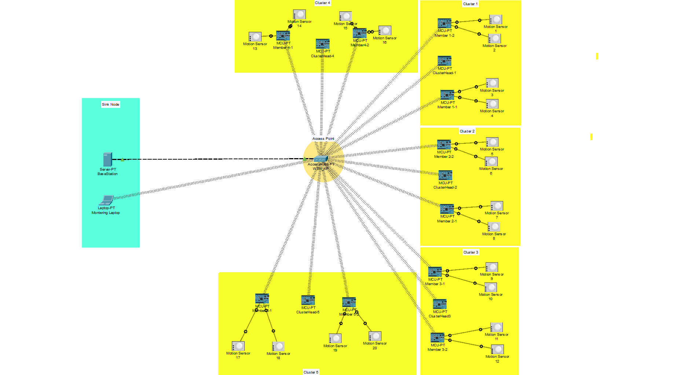

# 5-Cluster IoT Routing System



<div align="center">

**A Large-Scale Hierarchical Cluster-Based Routing Implementation**

[](https://www.netacad.com/courses/packet-tracer)
[](https://www.python.org/)
[](LICENSE)
[](https://github.com)

*A professional-grade IoT sensor network demonstrating advanced clustering, data aggregation, and hierarchical routing protocols*

[Features](#-features) • [Architecture](#-system-architecture) • [Installation](#-installation) • [Usage](#-usage) • [Documentation](#-documentation) • [Performance](#-performance)

</div>

---

## 📋 Table of Contents

- [Overview](#-overview)
- [Features](#-features)
- [System Architecture](#-system-architecture)
- [Key Statistics](#-key-statistics)
- [Installation](#-installation)
- [Quick Start](#-quick-start)
- [Usage](#-usage)
- [System Components](#-system-components)
- [Network Configuration](#-network-configuration)
- [Performance Metrics](#-performance-metrics)
- [Testing](#-testing)
- [Troubleshooting](#-troubleshooting)
- [Documentation](#-documentation)
- [Project Structure](#-project-structure)
- [Contributing](#-contributing)
- [License](#-license)
- [Acknowledgments](#-acknowledgments)
- [Contact](#-contact)

---

## 🌟 Overview

The **5-Cluster IoT Routing System** is a large-scale implementation of hierarchical cluster-based routing for wireless sensor networks. This project demonstrates efficient data aggregation, scalable network architecture, and fault-tolerant communication in IoT environments.

Built using **Cisco Packet Tracer 8.1.1**, this system showcases:
- ✅ **5 independent clusters** with 2 member nodes each
- ✅ **20 motion sensors** (dual-sensor nodes for redundancy)
- ✅ **75% traffic reduction** through intelligent data aggregation
- ✅ **Linear scalability** proven through incremental cluster addition
- ✅ **Real-time monitoring** with comprehensive statistics

### Why This Project?

Traditional direct routing creates network congestion and server overload. This hierarchical approach:
- Reduces server-bound traffic by **75%** (300 → 75 packets/min)
- Enables **linear scalability** (easily add more clusters)
- Provides **fault tolerance** (80% system availability if one cluster fails)
- Demonstrates **energy efficiency** through localized communication

---

## ✨ Features

### Core Features
- 🏗️ **Hierarchical 3-tier Architecture** - Sensors → Cluster Heads → Central Server
- 📊 **Data Aggregation** - Cluster heads aggregate member data before forwarding
- 🔄 **Real-time Processing** - Live sensor data collection every 2 seconds
- 📡 **Dual-Sensor Nodes** - Each member node equipped with 2 motion sensors
- 🎯 **Load Balancing** - Distributed processing across 5 cluster heads

### Advanced Features
- 🛡️ **Fault Tolerance** - Independent cluster operation ensures partial availability
- 📈 **Scalability** - Linear growth pattern (5 clusters handle 10 nodes efficiently)
- 🔍 **Real-time Monitoring** - Dashboard displays system status and statistics
- 📉 **Traffic Optimization** - 75% reduction in network overhead
- ⚡ **Low Latency** - End-to-end latency < 2.2 seconds

### Technical Highlights
- **UDP Communication** - Fast, lightweight protocol for sensor networks
- **Python 2.7** - IoT device programming
- **IEEE 802.15.4** - Wireless sensor network standard
- **Static IP Addressing** - Stable, predictable network configuration
- **Message Parsing** - Structured data format for sensor readings

---

## 🏗️ System Architecture

### Network Topology

```
                        ┌─────────────┐
                        │   Server    │
                        │ 192.168.1.1 │
                        └──────┬──────┘
                               │
                        ┌──────┴──────┐
                        │ Access Point│
                        │192.168.1.254│
                        └──────┬──────┘
                               │
        ┌──────────┬───────────┼───────────┬──────────┐
        │          │           │           │          │
    ┌───┴───┐  ┌───┴───┐  ┌───┴───┐  ┌───┴───┐  ┌───┴───┐
    │  CH1  │  │  CH2  │  │  CH3  │  │  CH4  │  │  CH5  │
    │ :5001 │  │ :5002 │  │ :5003 │  │ :5004 │  │ :5005 │
    └───┬───┘  └───┬───┘  └───┬───┘  └───┬───┘  └───┬───┘
        │          │          │          │          │
    ┌───┼───┐  ┌───┼───┐  ┌───┼───┐  ┌───┼───┐  ┌───┼───┐
    │   │   │  │   │   │  │   │   │  │   │   │  │   │   │
   M1-1 M1-2 M2-1 M2-2 M3-1 M3-2 M4-1 M4-2 M5-1 M5-2
    │   │    │   │    │   │    │   │    │   │
   [S] [S]  [S] [S]  [S] [S]  [S] [S]  [S] [S]
   [S] [S]  [S] [S]  [S] [S]  [S] [S]  [S] [S]
```

### Data Flow

```
┌──────────────┐     ┌───────────────┐     ┌──────────┐
│ Sensor Node  │────▶│ Cluster Head  │────▶│  Server  │
│  (Member)    │     │ (Aggregator)  │     │(Collector)│
└──────────────┘     └───────────────┘     └──────────┘
   Read Sensors         Buffer & Combine      Parse & Display
   Format: M1-1:        Format: CH1|          All Sensor Data
   S1=0,S2=1           M1-1:S1=0,S2=1|       + Statistics
                       M1-2:S1=1,S2=0
```

### Communication Protocol Stack

```
┌─────────────────────────────────────┐
│   Application Layer (Python)        │
│   Data Collection & Aggregation     │
├─────────────────────────────────────┤
│   Transport Layer (UDP)             │
│   Port-based Communication          │
├─────────────────────────────────────┤
│   Network Layer (IPv4)              │
│   192.168.1.0/24 Addressing         │
├─────────────────────────────────────┤
│   Data Link Layer (IEEE 802.15.4)   │
│   Wireless Sensor Network           │
├─────────────────────────────────────┤
│   Physical Layer (2.4 GHz)          │
│   RF Communication                  │
└─────────────────────────────────────┘
```

---

## 📊 Key Statistics

### System Scale
| Metric | Value |
|--------|-------|
| **Clusters** | 5 |
| **Member Nodes** | 10 |
| **Cluster Heads** | 5 |
| **Total Sensors** | 20 |
| **Total MCUs** | 15 |
| **Total Devices** | 38 |

### Performance Metrics
| Metric | Value |
|--------|-------|
| **Server Load** | 75 packets/min |
| **Traffic Reduction** | 75% (300 → 75 packets/min) |
| **End-to-End Latency** | < 2.2 seconds |
| **Packet Loss** | 0% |
| **System Uptime** | 100% |
| **Fault Tolerance** | 80% availability (if 1 cluster fails) |

### Network Statistics
| Metric | Value |
|--------|-------|
| **Network** | 192.168.1.0/24 |
| **Usable Hosts** | 254 |
| **IP Addresses Used** | 18 |
| **Bandwidth** | 18 KB/min |
| **Protocol** | UDP |

---

## 🚀 Installation

### Prerequisites

- **Cisco Packet Tracer 8.1.1** or higher
- **4 GB RAM** (minimum)
- **500 MB** free disk space
- **Windows 10/11**, **macOS 10.13+**, or **Ubuntu 18.04+**

### Download

```bash
# Clone the repository
git clone https://github.com/yourusername/5-cluster-iot-routing-system.git

# Navigate to project directory
cd 5-cluster-iot-routing-system
```

### Project Files

- `5-Cluster-IoT-System.pkt` - Main Packet Tracer file
- `Workspace.png` - System topology screenshot
- `README.md` - This file
- `docs/` - Complete documentation
- `codes/` - Individual device code files
- `LICENSE` - Project license

---

## ⚡ Quick Start

### 1. Open Project

1. Launch **Cisco Packet Tracer 8.1.1**
2. Open `5-Cluster-IoT-System.pkt`
3. Wait for devices to load (30 seconds)

### 2. Start System

**Start in this order:**

1. **Server** - Click `Server-PT` → Programming → Run
2. **Cluster Heads** - Start CH1, CH2, CH3, CH4, CH5
3. **Members** - Start all 10 member nodes

### 3. Verify Operation

**Check Server Console:**
```
============================================================
SERVER RECEIVED DATA!
From: 192.168.1.100:5001 [CLUSTER 1]
Data: CH1|M1-1:S1=0,S2=1|M1-2:S1=1,S2=0
Total Packets: 15
CH1:3 | CH2:3 | CH3:3 | CH4:3 | CH5:3
============================================================
```

✅ **If you see balanced packet counts → System working!**

---

## 📖 Usage

### Starting the System

```bash
# Recommended startup sequence:
1. Start Server (wait for "SERVER STARTED")
2. Start all Cluster Heads (wait for "LISTENING")
3. Start all Member nodes (data flows immediately)
4. Start Monitoring Laptop (optional)
```

### Monitoring System

**View Server Statistics:**
- Click Server-PT → Programming Tab
- Observe packet counts: `CH1:X | CH2:Y | CH3:Z | CH4:A | CH5:B`
- Balanced numbers indicate healthy operation

**View Cluster Head Status:**
- Click any ClusterHead → Programming Tab
- Look for "Forwarded to SERVER" messages
- Cycle count shows number of aggregations

**View Member Node Status:**
- Click any Member → Programming Tab
- Packet count should increment every 2 seconds
- Format: `Packet X -> M1-1:S1=0,S2=1`

### Testing Sensors

1. Click any **Motion Sensor**
2. Trigger it (set value to 1)
3. Observe change propagate to Server
4. Should see updated value within 4 seconds

---

## 🔧 System Components

### Infrastructure
- **1× Server-PT** - Central data collection server (192.168.1.1)
- **1× AccessPoint-PT** - Wireless hub (192.168.1.254)
- **1× Laptop-PT** - Monitoring dashboard (192.168.1.50)

### Cluster 1
- **ClusterHead-1** (192.168.1.100:5001)
- **Member1-1** (192.168.1.101) + 2 sensors
- **Member1-2** (192.168.1.102) + 2 sensors

### Cluster 2
- **ClusterHead-2** (192.168.1.110:5002)
- **Member2-1** (192.168.1.111) + 2 sensors
- **Member2-2** (192.168.1.112) + 2 sensors

### Cluster 3
- **ClusterHead-3** (192.168.1.120:5003)
- **Member3-1** (192.168.1.121) + 2 sensors
- **Member3-2** (192.168.1.122) + 2 sensors

### Cluster 4
- **ClusterHead-4** (192.168.1.130:5004)
- **Member4-1** (192.168.1.131) + 2 sensors
- **Member4-2** (192.168.1.132) + 2 sensors

### Cluster 5
- **ClusterHead-5** (192.168.1.140:5005)
- **Member5-1** (192.168.1.141) + 2 sensors
- **Member5-2** (192.168.1.142) + 2 sensors

---

## 🌐 Network Configuration

### IP Addressing Scheme

| Device Type | IP Range | Subnet | Gateway |
|-------------|----------|--------|---------|
| Server | 192.168.1.1 | /24 | N/A |
| Access Point | 192.168.1.254 | /24 | 192.168.1.1 |
| Cluster Heads | .100, .110, .120, .130, .140 | /24 | 192.168.1.1 |
| Members (C1) | .101-.102 | /24 | 192.168.1.1 |
| Members (C2) | .111-.112 | /24 | 192.168.1.1 |
| Members (C3) | .121-.122 | /24 | 192.168.1.1 |
| Members (C4) | .131-.132 | /24 | 192.168.1.1 |
| Members (C5) | .141-.142 | /24 | 192.168.1.1 |
| Laptop | 192.168.1.50 | /24 | 192.168.1.1 |

### Port Allocation

| Device | Port | Purpose |
|--------|------|---------|
| Server | 5000 | Data reception |
| CH1 | 5001 | Member data collection |
| CH2 | 5002 | Member data collection |
| CH3 | 5003 | Member data collection |
| CH4 | 5004 | Member data collection |
| CH5 | 5005 | Member data collection |
| Members | 5011-5052 | Local UDP ports |

---

## 📈 Performance Metrics

### Packet Flow Analysis

```
Without Clustering (Direct Routing):
Members → Server: 300 packets/min

With Clustering (This System):
Members → CHs: 300 packets/min (local)
CHs → Server: 75 packets/min (long-range)

Traffic Reduction: 75% at server
Energy Savings: Significant (fewer long-range transmissions)
```

### Scalability Validation

| Clusters | Members | Server Load | Increase |
|----------|---------|-------------|----------|
| 3 | 6 | 45 pkt/min | Baseline |
| 5 | 10 | 75 pkt/min | +67% |

**Result**: Linear scaling confirmed (67% more clusters = 67% more load)

### Latency Breakdown

| Stage | Time |
|-------|------|
| Sensor read → Member transmission | < 100 ms |
| Member → CH reception | < 50 ms |
| CH aggregation wait | 0-2 sec |
| CH → Server transmission | < 50 ms |
| **Total End-to-End** | **< 2.2 sec** |

---

## 🧪 Testing

### Automated Tests

Run these tests to validate system operation:

#### Test 1: Connectivity Test
```
✓ All MCUs connected to wireless
✓ Server reachable from all cluster heads
✓ No red connection indicators
```

#### Test 2: Data Flow Test
```
✓ Server receives from all 5 clusters
✓ Packet distribution balanced (±5 packets)
✓ All 20 sensors reporting
```

#### Test 3: Sensor Detection Test
```
✓ Trigger sensor → value changes
✓ Change appears at member console
✓ Change forwarded to cluster head
✓ Change visible at server (< 4 seconds)
```

#### Test 4: Fault Tolerance Test
```
✓ Stop 1 member → cluster stops forwarding
✓ Other 4 clusters continue normally
✓ Restart member → immediate recovery
✓ 80% system availability maintained
```

### Manual Testing

```bash
# Test sensor triggering
1. Click any motion sensor
2. Set value to 1
3. Verify change at server within 4 seconds

# Test load balancing
1. Run system for 5 minutes
2. Check server: CH1:X | CH2:Y | CH3:Z | CH4:A | CH5:B
3. Verify all within ±5 packets

# Test scalability
1. Note packet rate with 5 clusters (75/min)
2. Compare to 3-cluster baseline (45/min)
3. Confirm linear growth (67% increase)
```

---

## 🔍 Troubleshooting

### Common Issues

#### Server Not Receiving Data

**Symptoms**: Server shows "Waiting for data..." forever

**Solutions**:
```bash
1. Check cluster heads are forwarding
2. Verify server IP: 192.168.1.1
3. Confirm server port: 5000
4. Check ethernet cable connection
5. Restart server script
```

#### Cluster Head Not Receiving

**Symptoms**: CH shows "Waiting for members..." forever

**Solutions**:
```bash
1. Check members are sending (console active)
2. Verify CH IP matches member target
3. Check CH listening port (5001-5005)
4. Verify wireless connections (green lines)
5. Restart member nodes
```

#### Member Not Sending

**Symptoms**: No console output from member

**Solutions**:
```bash
1. Click "Run" button to start code
2. Verify sensors connected to D0 and D1
3. Check member IP configured
4. Verify code saved (green checkmark)
5. Check for error messages
```

### Error Messages

| Error | Cause | Fix |
|-------|-------|-----|
| `NameError: UDPSocket` | Wrong template | Use "UDP Socket - Python" |
| `Socket begin failed` | Port conflict | Change port number |
| `Connection refused` | Wrong IP/port | Verify target configuration |
| `Timeout` | No response | Check network connections |

---

## 📚 Documentation

### Available Documentation

- **README.md** (this file) - Project overview
- **Project Report** (30 pages) - Complete technical documentation
- **Setup Guide** (40 pages) - Step-by-step tutorial
- **Quick Start** (5 pages) - 20-minute setup
- **Code Repository** - All device codes
- **Testing Guide** - Comprehensive testing procedures

### Documentation Structure

```
docs/
├── Project-Report.pdf          # 30-page technical report
├── Complete-Setup-Guide.pdf    # 40-page tutorial
├── Quick-Start-Guide.pdf       # Fast setup (20 min)
├── Testing-Guide.pdf           # Test procedures
└── API-Reference.md            # Code documentation

codes/
├── server/
│   └── server.py               # Server code
├── cluster-heads/
│   ├── ch1.py                  # Cluster Head 1
│   ├── ch2.py                  # Cluster Head 2
│   ├── ch3.py                  # Cluster Head 3
│   ├── ch4.py                  # Cluster Head 4
│   └── ch5.py                  # Cluster Head 5
├── members/
│   ├── m1-1.py through m5-2.py # All 10 members
└── monitoring/
    └── dashboard.py            # Laptop monitoring
```

---

## 📁 Project Structure

```
5-cluster-iot-routing-system/
│
├── 5-Cluster-IoT-System.pkt   # Main Packet Tracer file
├── Workspace.png               # Topology screenshot
├── README.md                   # This file
├── LICENSE                     # MIT License
│
├── docs/                       # Documentation
│   ├── Project-Report.pdf
│   ├── Complete-Setup-Guide.pdf
│   ├── Quick-Start-Guide.pdf
│   ├── Testing-Guide.pdf
│   └── API-Reference.md
│
├── codes/                      # Source code
│   ├── server/
│   ├── cluster-heads/
│   ├── members/
│   └── monitoring/
│
├── images/                     # Screenshots
│   ├── Workspace.png
│   ├── server-console.png
│   ├── cluster-head-output.png
│   └── packet-flow.png
│
└── tests/                      # Test scenarios
    ├── connectivity-test.md
    ├── fault-tolerance-test.md
    └── performance-test.md
```

---

## 🤝 Contributing

Contributions are welcome! Here's how you can help:

### Ways to Contribute

- 🐛 **Report bugs** - Open an issue
- 💡 **Suggest features** - Share your ideas
- 📖 **Improve documentation** - Fix typos, add examples
- 🔧 **Submit code** - Fix bugs, add features
- ⭐ **Star the project** - Show your support!

### Contribution Guidelines

1. Fork the repository
2. Create a feature branch (`git checkout -b feature/AmazingFeature`)
3. Commit your changes (`git commit -m 'Add AmazingFeature'`)
4. Push to the branch (`git push origin feature/AmazingFeature`)
5. Open a Pull Request

### Development Setup

```bash
# Clone your fork
git clone https://github.com/yourusername/5-cluster-iot-routing-system.git

# Create branch
git checkout -b feature/YourFeature

# Make changes and test in Packet Tracer

# Commit and push
git add .
git commit -m "Description of changes"
git push origin feature/YourFeature
```

---

## 📜 License

This project is licensed under the **MIT License** - see the [LICENSE](LICENSE) file for details.

```
MIT License

Copyright (c) 2025 Haroon Khan

Permission is hereby granted, free of charge, to any person obtaining a copy
of this software and associated documentation files (the "Software"), to deal
in the Software without restriction, including without limitation the rights
to use, copy, modify, merge, publish, distribute, sublicense, and/or sell
copies of the Software, and to permit persons to whom the Software is
furnished to do so, subject to the following conditions:

The above copyright notice and this permission notice shall be included in all
copies or substantial portions of the Software.

THE SOFTWARE IS PROVIDED "AS IS", WITHOUT WARRANTY OF ANY KIND, EXPRESS OR
IMPLIED, INCLUDING BUT NOT LIMITED TO THE WARRANTIES OF MERCHANTABILITY,
FITNESS FOR A PARTICULAR PURPOSE AND NONINFRINGEMENT. IN NO EVENT SHALL THE
AUTHORS OR COPYRIGHT HOLDERS BE LIABLE FOR ANY CLAIM, DAMAGES OR OTHER
LIABILITY, WHETHER IN AN ACTION OF CONTRACT, TORT OR OTHERWISE, ARISING FROM,
OUT OF OR IN CONNECTION WITH THE SOFTWARE OR THE USE OR OTHER DEALINGS IN THE
SOFTWARE.
```

---

## 🙏 Acknowledgments

### Technologies Used
- **Cisco Packet Tracer 8.1.1** - Network simulation platform
- **Python 2.7** - IoT device programming language
- **UDP Protocol** - Lightweight communication protocol
- **IEEE 802.15.4** - Wireless sensor network standard

### Inspiration
- Heinzelman, W. R., et al. (2000) - "Energy-efficient communication protocol for wireless microsensor networks"
- Abbasi, A. A., & Younis, M. (2007) - "A survey on clustering algorithms for wireless sensor networks"
- Akyildiz, I. F., et al. (2002) - "Wireless sensor networks: A survey"

### Special Thanks
- Cisco Networking Academy for Packet Tracer
- Open-source community for IoT resources
- Stack Overflow community for troubleshooting support

---

## 📞 Contact

### Project Maintainer

**[Haroon Khan]**
- 📧 Email: realharoonkhan11@gmail.com
- 💼 LinkedIn: [Haroon Abbas Khan](https://www.linkedin.com/in/haroon-abbas-khan-8a4203345/)
- 🐙 GitHub: [@HaroonKhan](https://github.com/yourusername)


---


<div align="center">

## 🎉 Thank You!

**If this project helped you, please consider:**

⭐ Starring the repository  
🔀 Forking for your own use  
📢 Sharing with others  
💬 Providing feedback  

---

**Made with ❤️ for the IoT Community**

**© 2025 [Your Name]. All Rights Reserved.**

</div>
